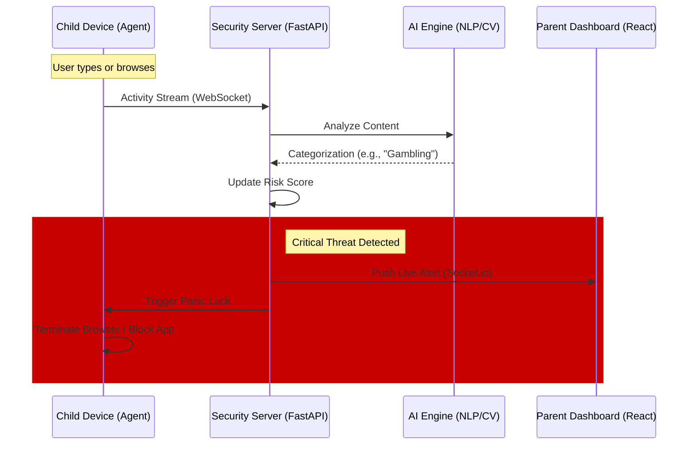

# SafeNet Kids: AI-Powered Digital Protection & Intelligence
## Technical Project Report

---

### 1. Introduction
SafeNet Kids is a next-generation parental intelligence platform designed to protect children from the evolving landscape of digital threats. Leveraging state-of-the-art Artificial Intelligence, the system provides real-time monitoring of keystrokes, screen content, and visual media to detect harmful intent, grooming, cyberbullying, and inappropriate content.

### 2. Problem Statement & Objectives
**Problem Statement:**
Traditional parental controls rely on static URL blacklists and simple time limits, which are easily bypassed and fail to detect behavioral patterns or intent. With the rise of encrypted messaging and modern social apps, parents lack visibility into the *context* of their child's digital life.

### 3. Proposed System
SafeNet Kids follows a distributed, full-stack security architecture:
1.  **Parent Dashboard**: A web-based management portal (React + Tailwind + ShadCN) for live monitoring.
2.  **Security Server**: A central FastAPI backend that processes intelligence and routes alerts.
3.  **Monitoring Agent**: A low-latency Python agent running on the child's device for telemetry.
4.  **AI Intelligence Hub**: Real-time NLP and Computer Vision services integrated into the backend.

---

### 4. System Design / Architecture

The following sequence diagram details the real-time protection flow:

---

### 5. Methodology & Working Process
1.  **Continuous Telemetry**: The Python agent monitors keystrokes and screen activity.
2.  **AI Image Moderation**: Gemini Vision and Local OCR analyze screenshots for threats like Gambling, Self-Harm, and Adult Content.
3.  **Instant Mitigation (Panic Lock)**: For high-risk categories (including Gambling, Violence, and Adult Content), the system triggers an immediate browser termination to prevent further exposure.

### 6. Technologies Used
- **Frontend**: React.js, ShadCN UI, Tailwind CSS.
- **Backend**: FastAPI, Socket.io, SQLAlchemy.
- **AI/ML**: Google Gemini (Direct API), NLTK, Scikit-Learn.
- **Agent**: Python, Pynput, OpenCV, PyGetWindow.

---

### 7. Advantages & Future Enhancements
**Advantages:**
- **Instant Response**: Real-time tab closing for critical threats.
- **Deep Intelligence**: Moves beyond URL filtering to content understanding.

**Future Enhancements:**
- Mobile Agent for Android/iOS.
- Cross-device screen time orchestration.

### 8. Conclusion
SafeNet Kids provides a robust, AI-driven defense system that empowers parents with real-time intelligence and automated protection, ensuring a safer digital environment for the next generation.
